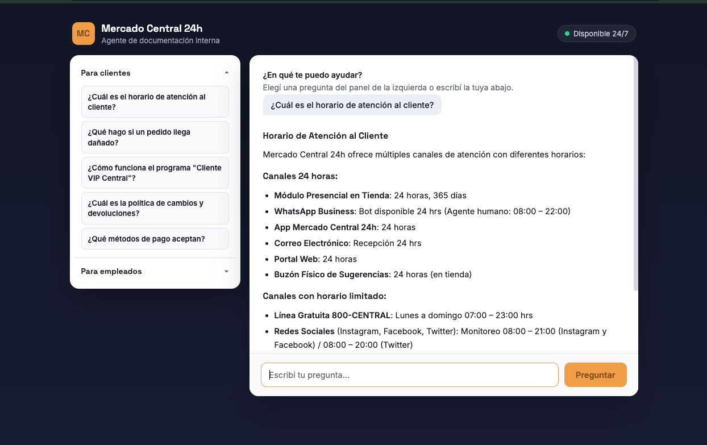

# marketplace-documentation-agent
IA Agent that answers question about documentation of a  24/7 marketplace  using Claude (Anthropic)
# Marketplace Documentation Agent
Open http://localhost:5000 in your browser.

## Example questions and answers

**Q: Cual es el horario de atencion al cliente?**

A: Mercado Central 24h ofrece atencion al cliente las 24 horas, los 7 dias de la semana, pero los horarios varian segun el canal: modulo presencial en tienda (24 hrs, 365 dias), linea gratuita 800-CENTRAL (lunes a domingo 07:00-23:00 hrs), WhatsApp Business (bot 24 hrs, agente humano 08:00-22:00), app (24 horas, autoservicio), correo electronico (recepcion 24 hrs), redes sociales (monitoreo entre 08:00 y 21:00 segun la plataforma).

Sources: b9abdeaf-ffcb-46c4-8e1b-16935a594875.pdf, c0a37625-c8ee-44f2-885f-7b30480d3017.pdf

**Q: Que debo hacer si un pedido llega danado?**

A: Reportar el problema dentro de las 2 horas siguientes a la recepcion (por la app o WhatsApp Business); se genera un folio de incidencia automaticamente; un agente contacta en un maximo de 30 minutos; se ofrece reposicion el mismo dia (si hay repartidor disponible) o un credito equivalente al valor del producto mas un 15% de bonificacion. Para productos perecederos, una foto por WhatsApp es suficiente como evidencia.

Sources: b9abdeaf-ffcb-46c4-8e1b-16935a594875.pdf, c0a37625-c8ee-44f2-885f-7b30480d3017.pdf

## Deployment

Live app: https://marketplace-documentation-agent.onrender.com/

The app is deployed on Render's free tier. Note: on the free plan, the service spins down after periods of inactivity, so the first request after idle time may take 30-60 seconds to respond while it wakes up.

## Design notes

- Embeddings use Gemini instead of a paid alternative to stay within a free tier; batches are kept small and requests are spaced out to respect the free-tier rate limits.
- Claude Haiku 4.5 was chosen over larger models to keep the cost per question very low while keeping answer quality high for this use case.
- No vector database was used; with under 500 chunks, an in-memory cosine similarity search with `numpy` is fast enough and keeps the project simple to deploy.